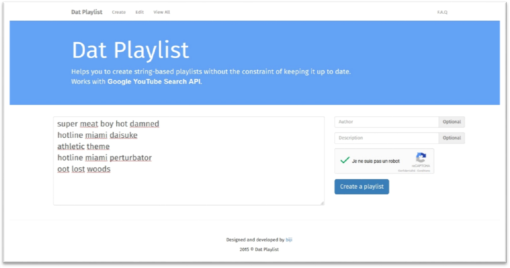
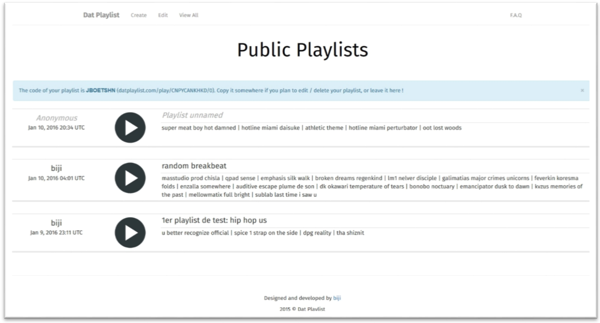
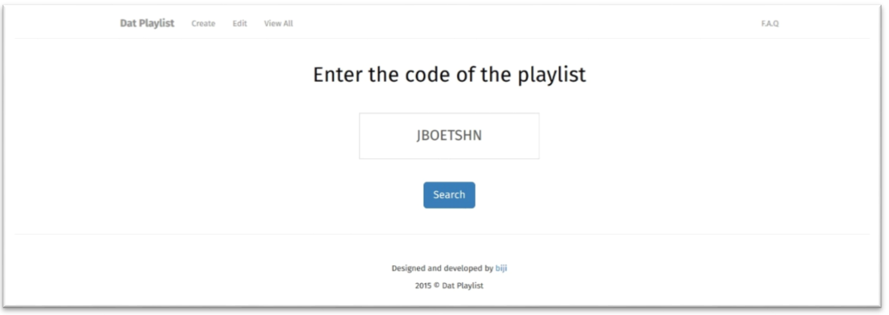
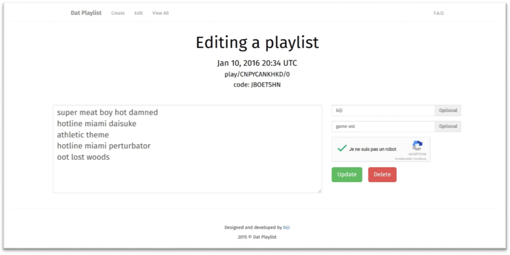
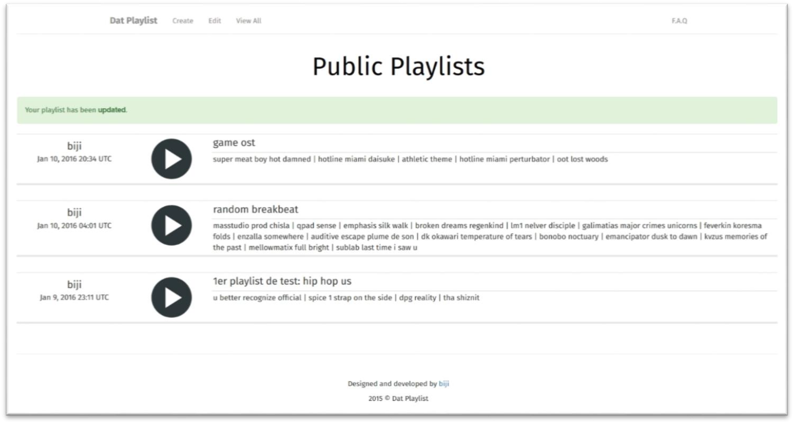
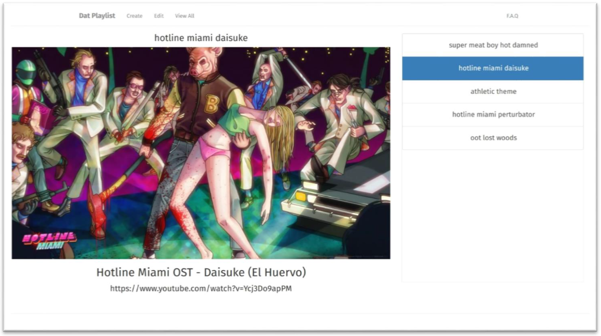

# datplaylist

Play live string based playlist on youtube

Computer project developed during my studies:
- developed in Ruby with Ruby on Rails framework
- self hosted (VPS) with custom domain at www.datplaylist.com (not working anymore)
- uses Google API (Youtube and ReCaptcha)

# Screenshots

### Homepage

### Public playlists page

### Search playlist

### Edit playlist

### Public playlists page after editing one

### Playlist page

# About

@2015